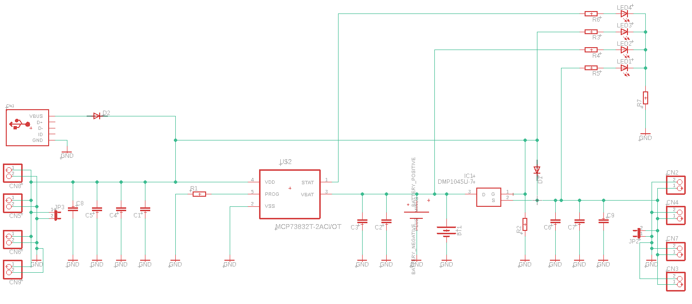
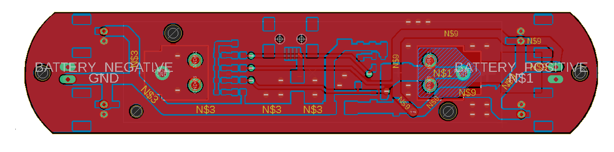

# Single-Cell 1S Charger Project

## Overview
This repository contains the design files for a simple and versatile single-cell 1S charger module. This charger is designed as an independent module with a battery holder, making it a plug-and-play solution for charging applications. It features a USB socket for power input and additional footprints for alternative connectors like JST, offering flexibility in power connection options.

The charger is based on the MCP73832, a highly integrated linear charge management controller suitable for use within a wide range of battery sizes and chemistries. Its compact form factor and simple functionality make it an ideal choice for portable applications.

## Features of MCP73832
- Linear charge management controller optimized for single-cell lithium-ion and lithium-polymer batteries.
- Programmable charge current from 15 mA to 500 mA.
- Preconditioning of deeply discharged batteries.
- Automatic end-of-charge control via charge termination and auto-recharge.
- Charge status output pin that can drive an LED.
- Thermal regulation to maximize charge rate without risk of overheating.

## Schematic
The schematic details the electrical design, showing how the MCP73832 is integrated to provide safe and efficient charging.

## PCB Layout
The PCB layout illustrates the component placement and routing, designed to be compact and efficient.

## Usage
To use the charger, connect a single-cell 1S battery to the battery holder, and power the charger via the USB socket or alternative power connector. An LED indicator provides real-time charging status based on the output from the MCP73832.

## Notes
- Make sure to use the charger with the appropriate battery chemistry and specifications as intended by the design.
- The charger design is based on the MCP73832 charge management controller which is optimized for single-cell lithium-ion and lithium-polymer batteries.
- It is important to verify the power input source and ensure that the USB power supply complies with the required specifications for charging.

## Contributions and Feedback
Contributions to this project are welcome. If you have suggestions for improvement or have developed additional features, please fork the repository, make your changes, and submit a pull request. For any questions or issues, please open an issue in the GitHub repository.

## License
This charger project is licensed under the MIT License with the following terms:

- **Permission to Use**: You are free to use, modify, and distribute this charger design in both private and commercial settings.
- **Attribution Requirement**: While not required, attribution to the original author, Adam Łuczak, is appreciated. This can be done through a citation or a link back to this repository.
- **No Warranty**: This design is provided "as is", without warranty of any kind. Use it at your own risk.
- **Liability**: The author is not liable for any damages or losses that may arise from the use of this design.

For the full terms and conditions, please refer to the MIT License documentation.

## Contact
Should you have any inquiries or suggestions regarding this charger project, please don't hesitate to contact Adam Łuczak at adam.luczak@outlook.com.
